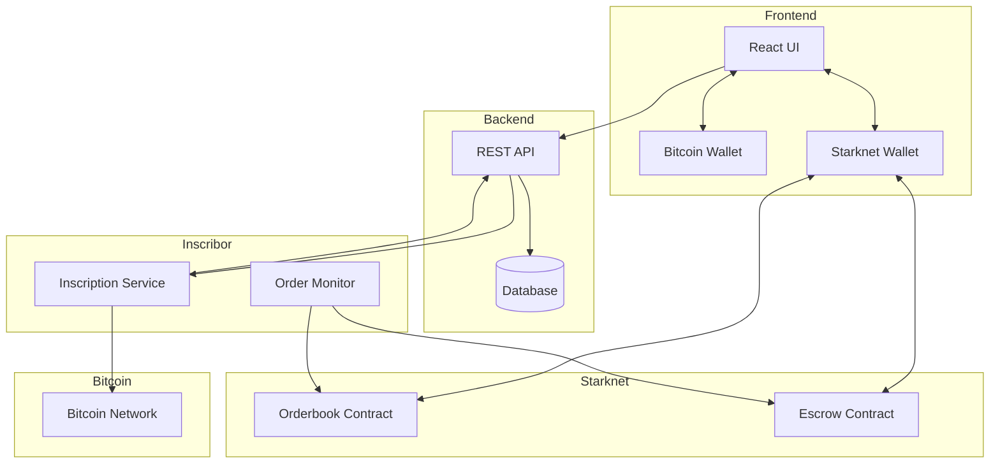

# Bitcoin Registry Orchestrates Like Yesterday (B.R.O.L.Y)

> Order on Starknet, write on Bitcoin, get money trustlessly, repeat

Broly is a decentralized Bitcoin inscription service that uses Starknet for orderbook management and escrow. It enables trustless Bitcoin inscriptions with guaranteed payments through smart contracts.

## Architecture



## Flow

1. User connects both Bitcoin and Starknet wallets
2. User creates an inscription order:
   - Specifies inscription content and reward amount
   - Order is created on Starknet orderbook
   - Funds are locked in escrow contract
3. Inscribor service:
   - Monitors pending orders
   - Creates Bitcoin inscriptions
   - Triggers escrow release on successful inscription
4. User receives inscription, inscribor receives reward

## Project Structure

```text
broly/
├── apps/
│   ├── web/               # Frontend React application
│   └── backend/           # REST API service
├── packages/
│   ├── inscribor/         # Bitcoin inscription service
│   ├── onchain/           # Starknet smart contracts
│   └── indexer/           # Starknet contract indexing
├── package.json
└── turbo.json
```

## Technology Stack

- Frontend:
  - React + TypeScript
  - Vite
  - TailwindCSS
  - Starknet.js
  - BitcoinJS-lib
- Backend:
  - Golang
  - Postgres DB
  - REST API
- Smart Contracts:
  - Cairo (Starknet)
  - Scarb
- Inscribor:
  - Node.js
  - BitcoinJS-lib
  - Starknet.js

## Getting Started

1. Run the app

```bash
docker compose up
```

1. Restart your app ( after changes to backend(s), indexer, ... )

```bash
docker compose down --volumes
docker compose build
docker compose up
```

## Components

### Frontend (web)

- New inscription order form
- Dashboard view for pending inscriptions
- Wallet connections (Bitcoin + Starknet)
- Order status tracking
- Exploring inscriptions

### Backend (backend)

- REST API for order management
- Status tracking endpoints
- Order history

### Smart Contracts (onchain)

- Orderbook contract
- Escrow contract
- Payment handling

### Inscribor Service

- Order monitoring
- Bitcoin inscription creation
- Transaction verification
- Starknet interaction for escrow release

## License

Broly is licensed under the MIT License. See the [LICENSE](LICENSE) file for details.
