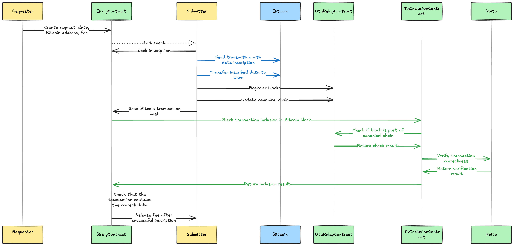
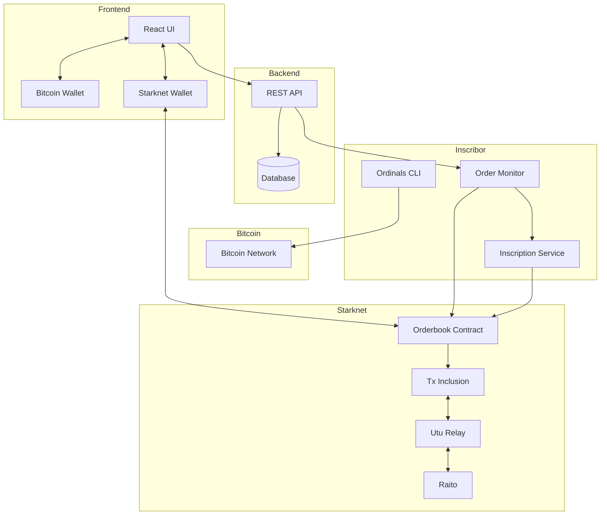

<div align="center">
  

  # B.R.O.L.Y.
  ***Bitcoin Registry Orchestrates Like Yesterday***
</div>

> Order on Starknet, write on Bitcoin, get money trustlessly, repeat

Broly is a decentralized Bitcoin inscription service that uses Starknet for orderbook management. It enables trustless Bitcoin inscriptions with guaranteed payments through smart contracts.

<div align="center">
<a href="https://github.com/keep-starknet-strange/broly/actions/workflows/contracts.yml"></a>
<a href="https://bitcoin.org/"> </a>
<a href="https://exploration.starkware.co/"></a>
</div>

---

## Disclaimer 

This codebase is an experimental PoC as part of Bitcoin explorations at StarkWare, and has not undergone a professional audit. 

## Why Broly? 

Broly is a showcase of the power of Starknet brought to the Bitcoin ecosystem. With Broly, a `Requester` without any funds on Bitcoin can get their data inscribed on Bitcoin for a `STRK` fee. All the `Requester` needs is a Bitcoin and a Starknet wallet extension. The Requester needs `STRK` on Starknet, but does not need any `BTC` on the Bitcoin network. The `Requester` broadcasts the request transaction to Starknet with data. The data is stored in the Broly contract. A `Submitter` running the `inscribor` service can pick up the request, inscribe the data on Bitcoin, and transfer it to the `Requester`'s Bitcoin address. The `Submitter` can submit the creation and transfer transactions to the Broly contract on Starknet, and get the full verification of the correctness of the transaction execution, transaction inclusion in the block, and the inclusion of the block in the canonical chain.

Try [Broly](https://www.broly-btc.com/)!

## Diagram 

<div align="center">
  
</div>

## Flow

1. `Requester` connects Starknet wallet extension: [Argent](https://www.argent.xyz/) or [Braavos](https://braavos.app/). Click `Login` in the top right corner. 
2. `Requester` gets `STRK` testnet tokens from the Starknet Foundation [faucet](https://starknet-faucet.vercel.app/). 
3. `Requester` creates an inscription order:
   - Specifies inscription content (data) as message (text) or from a set of predefined emojis.
   - Clicks `Inscribe` and connects pop up Bitcoin [Xverse](https://www.xverse.app/) wallet.
   - Reward amount in `STRK` is calculated automatically based on `BTC` / `STRK` price.
   - Bitcoin Taproot compatible address is automatically fetched from Xverse connected wallet.
   - Order is created and stored in the Broly contract.
   - `Requester`'s funds are locked in the Broly contract.
   - A `RequestCreated` event with the `inscription_id`, `caller`, `receiving_address`, and `fee` is emitted. 
   - The open request info is stored in the Broly database and is visible on the website at `https://www.broly-btc.com/request/{inscription_id}`.
   - The Requester is able to cancel the request and get the funds back. 
   - A `RequestCanceled` event with the `inscription_id` is emitted. 
   - It is not possible to predict how fast an inscription and a transfer transaction will be included in a Bitcoin block. Even though Starknet L2 is blazing fast and cheap, this is not the case with Bitcoin in 2025. It's strong security properties require waiting for a miner to pick up a transaction, include it in a block, do the proof of work, and submit it to the blockchain. The `Requester` has to wait for the `Submitter` to get at least 1 confirmation for each transaction. For 2 sequential transactions (you can send the inscription only after it has been insribed) it may take between 15 minutes and over an hour.
4. Locking script: 
   - A `Submitter` can lock the transaction with the [locking script](https://github.com/keep-starknet-strange/broly/blob/main/packages/scripts/lock_request.sh). Run from Broly root:

   ```
   bash ./packages/scripts/lock_request.sh {SN_account_name} {inscription_id}
   ```
   where `inscription_id` is the ID of the open order.
   - A `RequestLocked` event with the `inscription_id` is emitted. 
   - Order status changes to `Locked` on Broly website and in the Broly contract.
   - The lock is valid for 100 Starknet blocks. Within those 100 blocks, the `Submitter` has to create the inscription and transfer it to the `Requester`'s address on Bitcoin. 
   - The `Requester` cannot cancel the inscription if the lock has not expired. 
   - Another `Submitter` can only lock the inscription again if the lock has expired. 
   - Note that the Starknet wallet used to lock the inscription must be the same as the Starknet wallet used to submit the inscription. 
5. `ord` CLI (see [Installation Guide](https://github.com/ordinals/ord)) allows `Submitter` to:
   - Create or restore a Bitcoin address. Usage: 
   ```bash
   ord wallet create --help
   ``` 
   or 
   ```bash
   ord wallet restore --help
   ```
   - Allows `Submitter` to make the Bitcoin inscription. Usage: 
   ```bash
   ord \
   --bitcoin-rpc-username <USERNAME> \
   --bitcoin-rpc-password <PASSWORD> \
   --bitcoin-rpc-url http://127.0.0.1:8332 \
   wallet --name <NAME> \
   inscribe --file <FILE> \
   --fee-rate <FEE_RATE> \
   --destination <TAPROOT ADDRESS> \ 
   --postage 546sat
   ```
   The `ord` wallet doing the inscription must have a UTXO that has enough satoshis for the postage and for the fee. Send BTC to the taproot compatible wallet starting with `bc1`. The receiver address has to be passed with the `destination` flag and `postage` is the satoshis that will be sent in the same UTXO. The minimum `postage` value is 546sat, `fee-rate` is satoshis per byte. Replace the `bitcoin-rpc-url` with the node's URL. 
   - Note that the `ord` CLI requires the `Submitter` to run a Bitcoin full node, or use RPC connection. [Bitcoin Core](https://bitcoincore.org/en/blog/) client can be downloaded and run on a remote machine or locally and requires around 600GB initial download of data. An option for running a Bitcoin node is a [Digital Ocean droplet](https://cloud.digitalocean.com/droplets?i=fb217b), which allows for one click deployment and SSH connection. 
6. `bitcoin-on-starknet.js` package:
   - Fetches the Bitcoin data from the creation and transfer Bitcoin transactions.
   - Registers the Bitcoin blocks and updates the canonical chain with the [Utu Relay](https://bitcoin-on-starknet.com/bitcoin/introduction#the-utu-relayer-bridging-two-worlds) contract on Starknet.
   - Serializes it for `submit_inscription` to the Broly contract on Starknet.
   - Triggers `STRK` reward release to the `Submitter` on successful inscription.
   - Order status changes to `Closed` on Broly website and in the Broly contract. 
   - A `RequestCompleted` event with `tx_hash` and `inscription_id` is emitted. 

7. `Requester` owns the inscription on Bitcoin, `Submitter` receives reward on Starknet. 

## Running Broly locally for tests and development

1. Run the app

```bash
cp .env.example .env
# Edit .env variables to match your environment
docker compose up
```

View the website [locally](http://localhost:5173/). 

2. Restart your app ( after changes to backend(s), indexer, ... )

```bash
docker compose down --volumes
docker compose build
docker compose up
```

## For a `Requester`: Interacting with Broly as a user in one click

Head to the [Broly website](https://www.broly-btc.com/). 
Ensure that you have a Starknet wallet extension: [Argent](https://www.argent.xyz/) or [Braavos](https://braavos.app/) with funds (on https://sepolia.starkscan.co/ testnet, where the Broly contract is currently deployed). Choose Image/Message/Gif, upload your inscription data, approve the transaction and wait for a `Submitter` to complete your request. 

## For a `Submitter`: Interacting with the scripts to lock and submit transactions on Starknet 

Run
```
cp ./packages/bitcoin-on-starknet.js/.env.example ./packages/bitcoin-on-starknet.js/.env
```

Install [Starknet foundry](https://foundry-rs.github.io/starknet-foundry/getting-started/installation.html). 
[Create](https://foundry-rs.github.io/starknet-foundry/starknet/account.html#creating-and-deploying-accounts) a Starknet account using `sncast`. The name of the account will be passed to the scripts that interact with Starknet, and the address and private key for the Starknet provider environment variables. 

Lock an inscription:
```
bash ./packages/scripts/lock_request.sh {SN_account_name} {inscription_id}
```

Create an account and get a Bitcoin endpoint and a key at [Quicknode](https://www.quicknode.com/). Fill out the Bitcoin environment variables. 

Register blocks and update canonical chain by passing the `bitcoin_tx_hash` of the inscription transaction hash: 
```
bun run ./packages/bitcoin-on-starknet.js/scripts/updateCanonicalChain.ts {bitcoin_tx_hash}
```

```
bun run ./packages/bitcoin-on-starknet.js/scripts/submitInscription.ts {bitcoin_tx_hash} {inscription_id}
``` 
where `inscription_id` is the ID of the open order.

## Project Structure

```text
broly/
├── apps/
│   ├── web/                      # Frontend React application
│   └── backend/                  # REST API service
├── packages/
│   ├── onchain/                  # Starknet smart contracts
│   ├── scripts/                  # Deployment & Testing scripts
│   └── indexer/                  # Starknet contract indexing
│   └── infra/                    # Deployment configs
│   └── regtest/                  # Scripts for Bitcoin regtest testnet
│   └── bitcoin-on-starknet.js/   # Bitcoin data scripts
├── .github/
│   ├── workflows/                # GitHub workflows
├── package.json
└── turbo.json
└── docker-compose.yml
```

## Technology Stack

- Frontend:
  - React + TypeScript
  - Vite
  - TailwindCSS
  - Starknet.js
  - BitcoinJS-lib
- Backend:
  - Golang
  - Postgres DB
  - REST API
- Smart Contracts:
  - Cairo (Starknet)
  - Scarb
- Inscribor:
  - `ord` command-line wallet

## Components

### Frontend (web)

- New inscription order form
- Dashboard view for pending inscriptions
- Wallet connections (Bitcoin + Starknet)
- Order status tracking
- Exploring inscriptions

### Backend (backend)

- REST API for order management
- Status tracking endpoints
- Order history

### Smart Contracts (onchain) and dependencies

- Broly (Orderbook) contract
- Transaction inclusion
- Utu Relay contract
- Raito light client

### Inscribor Service

- `ord` CLI scripts
- Bitcoin inscription creation
- Transaction verification
- Starknet interaction for reward release

## Architecture



## Future development

  - `Fraud detection`: will be implemented for the Utu Relay contract. A user who is aware of a longer chain with more proof of work needs to be able to override a false block. 
  - `ZK proofs`: currently the inscribed data is stored onchain, and it is passed for verification inside the serialized Bitcoin transaction. The issue with it is that a large enough image in calldata can easily fill up the block. The solution is to have a ZK proof that the data is included in the witness field of the Bitcoin transaction. 
  - `Configurable security parameters`: a `Requester` needs to be able to set the number of confirmations that the transfer transaction got. Currently it's accepted if there is one or more confirmations.
  - `Configurable fees`: currently the `STRK` fee is calculated automatically based on the `STRK`/`BTC` price. In the future a `Requester` will be able to add `STRK` to incentivize the `Submitter`. 

## Credits 

   - The verification of Bitcoin transactions is possible thanks to the [Exploration Team](https://github.com/keep-starknet-strange) at Starkware. [Raito](https://github.com/keep-starknet-strange/raito), a Bitcoin light client written in Cairo, and `shinigami`: A [Bitcoin script VM](https://github.com/keep-starknet-strange/shinigami), aka Bitcoin Execution Engine written in Cairo. 
   - The verification of the transaction inclusion in the block and maintaining the canonical chain is possible thanks to the [LFG labs](https://github.com/lfglabs-dev) team and their work on [Utu Relay](https://bitcoin-on-starknet.com/bitcoin/introduction#the-utu-relayer-bridging-two-worlds).
   - The debugging of the verification flow was possible thanks to the [Walnut](https://github.com/walnuthq) team and their transaction debugger. 

## License

Broly is licensed under the MIT License. See the [LICENSE](LICENSE) file for details.
