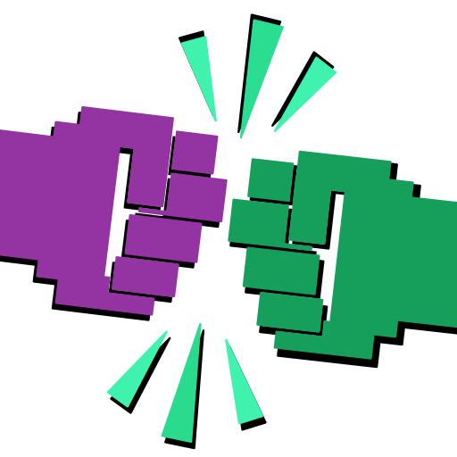
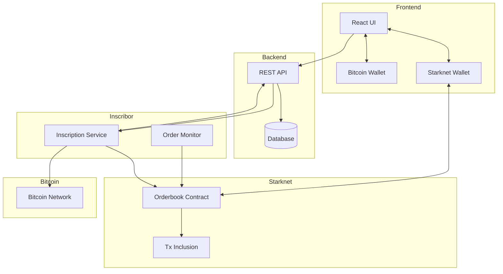

<div align="center">
  

  # B.R.O.L.Y.
  ***Bitcoin Registry Orchestrates Like Yesterday***
</div>

> Order on Starknet, write on Bitcoin, get money trustlessly, repeat

Broly is a decentralized Bitcoin inscription service that uses Starknet for orderbook management. It enables trustless Bitcoin inscriptions with guaranteed payments through smart contracts.

<div align="center">
<a href="https://github.com/keep-starknet-strange/broly/actions/workflows/contracts.yml"></a>
<a href="https://bitcoin.org/"> </a>
<a href="https://exploration.starkware.co/"></a>
</div>

---

## Why Broly? 

Broly is a showcase of the power of Starknet brought to the Bitcoin ecosystem. With Broly, a user without any funds on Bitcoin can get their data inscribed on Bitcoin for a `STRK` fee. All they need is a Bitcoin and a Starknet wallet extension. They broadcast their request transaction to Starknet. The data is stored in the Broly contract. A user running the `inscribor` service can pick up the request, inscribe the data on Bitcoin, and transfer it to the requester's Bitcoin address. The `inscribor` can submit the creation and transfer transactions to the Broly contract on Starknet, and get the full verification of the correctness of the transaction execution. 

Try [Broly](https://www.broly-btc.com/)!

### Dependencies

`raito`: A provable [Bitcoin light client](https://github.com/keep-starknet-strange/raito) written in Cairo. 

`shinigami`: A [Bitcoin script VM](https://github.com/keep-starknet-strange/shinigami), aka Bitcoin Execution Engine in Cairo. 

`utu_relay`: A [smart contract](https://github.com/lfglabs-dev/utu_relay) that enables secure verification of Bitcoin transactions and events, and bridges Bitcoin data to Starknet. 

Kudos to the [Exploration](https://github.com/keep-starknet-strange) team and [LFG](https://github.com/lfglabs-dev) labs for the effort!

## Architecture



## Flow

1. User connects both Bitcoin [Xverse](https://www.xverse.app/) and [Starknet](https://www.argent.xyz/) Argent or [Braavos](https://braavos.app/) wallets
2. User creates an inscription order:
   - Specifies inscription content and reward amount
   - Order is created on Starknet orderbook
   - Funds are locked in the contract
3. Inscribor service:
   - Monitors pending orders
   - Creates Bitcoin inscriptions
   - Triggers reward release on successful inscription
4. User receives inscription, inscribor receives reward

## Getting Started

1. Run the app

```bash
cp .env.example .env
# Edit .env variables to match your environment
docker compose up
```

View the website [locally](http://localhost:5173/). 

2. Restart your app ( after changes to backend(s), indexer, ... )

```bash
docker compose down --volumes
docker compose build
docker compose up
```

2. Run the proof-utils package

```bash
cd packages/proof-utils
pnpm add -D typescript ts-node
pnpm run build 
node dist/index.js
```

The script will print the serialized transaction hex.

## Project Structure

```text
broly/
├── apps/
│   ├── web/               # Frontend React application
│   └── backend/           # REST API service
├── packages/
│   ├── inscribor/         # Bitcoin inscription service
│   ├── onchain/           # Starknet smart contracts
│   ├── scripts/           # Deployment & Testing scripts
│   └── indexer/           # Starknet contract indexing
├── package.json
└── turbo.json
```

## Technology Stack

- Frontend:
  - React + TypeScript
  - Vite
  - TailwindCSS
  - Starknet.js
  - BitcoinJS-lib
- Backend:
  - Golang
  - Postgres DB
  - REST API
- Smart Contracts:
  - Cairo (Starknet)
  - Scarb
- Inscribor:
  - Node.js
  - BitcoinJS-lib
  - Starknet.js

## Components

### Frontend (web)

- New inscription order form
- Dashboard view for pending inscriptions
- Wallet connections (Bitcoin + Starknet)
- Order status tracking
- Exploring inscriptions

### Backend (backend)

- REST API for order management
- Status tracking endpoints
- Order history

### Smart Contracts (onchain)

- Orderbook contract
- Transaction inclusion
- Payment handling

### Inscribor Service

- Order monitoring
- Bitcoin inscription creation
- Transaction verification
- Starknet interaction for reward release

## License

Broly is licensed under the MIT License. See the [LICENSE](LICENSE) file for details.
